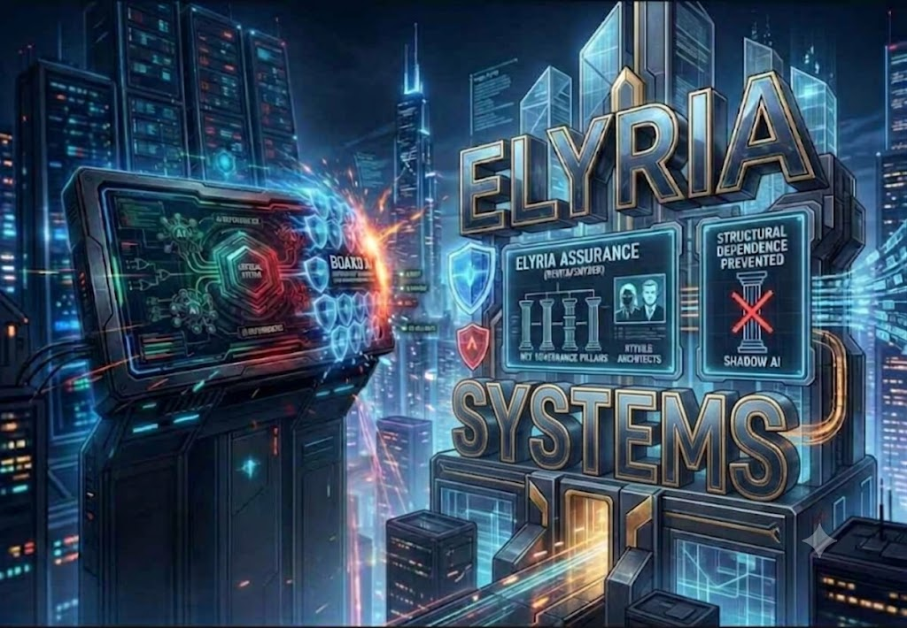

<div align="center">

# ⚡ Board AI Dependency Boundary ⚡

### by **ELYRIA SYSTEMS**



<br/>


### **Board-facing assurance** for **AI dependencies** before they become **structural consequence**.

**No receipt, no board assurance.**  
**No replay, no dependency confidence.**  
**No proof surface, no category claim.**

</div>

---

## 🏛️ System Attribution

**System:** **ELYRIA SYSTEMS**  
**Lead Architect:** **Samantha Revita**  
**Lead Architect:** **Terry Snyder**  
**Repository:** **Board AI Dependency Boundary**  
**Category:** **Board-facing AI dependency assurance / consequence-boundary review**

This repository is part of the **ELYRIA SYSTEMS** governance and execution-boundary portfolio.

---

## 🚀 Deployable Sandbox

This repo now includes a bounded deployable sandbox for customer review and pilot demonstration.

| Deployment Path | Command |
|---|---|
| **Local Python** | `python app/sandbox_app.py` |
| **Docker** | `docker build -t elyria-board-ai-boundary-sandbox .` |
| **Docker Compose** | `docker compose up --build` |

See [`DEPLOYMENT.md`](DEPLOYMENT.md) for the full deployment guide.

The deployment surface is intentionally limited. It exposes intake, classification, receipt, replay, and revalidation behavior only. It does not expose the protected Elyria Systems substrate, kernel internals, private research corpus, unpublished math, or production enforcement architecture.

---

## 🔥 What This Is

The **Board AI Dependency Boundary** is a **high-consequence review layer** from **ELYRIA SYSTEMS** for identifying when **AI systems**, **vendors**, **memory**, **agents**, **tools**, **APIs**, or **retention structures** are becoming **load-bearing** inside an organization.

It gives **boards** and **executives** a **decision surface** before **AI infrastructure** quietly becomes **structural**.

> Has an **AI dependency** become **load-bearing** before **authority**, **retention**, **jurisdiction**, **reversibility**, and **consequence exposure** were approved?

---

## 🚨 The Problem This Solves

Companies are adopting **AI tools**, **agentic systems**, **model providers**, **memory layers**, **workflow automations**, and **vendor platforms** faster than leadership can prove what those dependencies now control.

The common failure is not that an AI tool exists. The failure is that an AI dependency becomes **structural** before the organization can answer:

- **Who authorized it?**
- **What does it retain?**
- **Where does the data or memory live?**
- **What decisions can it influence?**
- **What consequence can it bind?**
- **Can access be revoked immediately?**
- **Can the dependency be removed without operational failure?**
- **Can the decision be replayed and defended later?**

That gap creates **board exposure**, **regulatory exposure**, **cyber exposure**, **vendor lock-in**, **audit failure**, **cross-border risk**, and **operational dependency without executive approval**.

This project gives companies a way to identify the dependency before it becomes invisible infrastructure.

---

## 🧨 Enterprise Failure Modes Covered

This review layer is designed to catch the failure modes that usually appear only after deployment pressure has already created reliance:

- **Shadow AI adoption** without executive approval
- **Persistent memory** that no one can fully inspect, export, sever, or delete
- **Vendor-controlled model changes** that alter behavior after approval
- **Agentic tool access** that can trigger workflow or system mutation
- **Cross-border processing** without jurisdictional clarity
- **Regulated workflow influence** without matching authority
- **Audit gaps** where the decision cannot be reconstructed
- **Exit failure** where the organization cannot revoke, migrate, or isolate the dependency
- **Structural reliance** before board-level approval
- **Receipt failure** where no formal proof exists that the boundary was reviewed
- **Replay failure** where changed facts do not trigger changed decisions

---

## ⚔️ Why Existing Approaches Do Not Compare

Most AI governance tools stop at **policy**, **questionnaires**, **risk scoring**, **model cards**, **dashboards**, **compliance checklists**, or **post-deployment monitoring**.

Those are useful, but they usually do not answer the board-level dependency question:

> Can this AI dependency now bind consequence, retain memory, alter workflow, or create structural reliance without approved authority and a provable exit path?

| Common Approach | What It Usually Covers | What It Misses |
|---|---|---|
| **AI policy templates** | Rules and acceptable-use language | Whether the dependency has become **load-bearing** |
| **Risk questionnaires** | Intake answers and vendor attestations | Whether consequence can **bind** through the dependency |
| **Model cards** | Model behavior and limitations | Runtime authority, retention, exit, and board exposure |
| **Dashboards** | Visibility and monitoring | Whether invalid movement is refused before consequence |
| **Compliance checklists** | Regulatory mapping | Whether authority matches the consequence class |
| **Vendor reviews** | Procurement and security posture | Whether removal would break operations or auditability |
| **Post-deployment monitoring** | What happened after launch | Whether the boundary held before structural reliance formed |

This layer is different because it reviews the **dependency boundary**, not just the **tool**.

It asks whether the organization has proof over **authority**, **retention**, **jurisdiction**, **reversibility**, **receipt**, **replay**, and **consequence exposure** before the dependency becomes structurally embedded.

---

## 🛡️ Core Function

This repo converts **AI dependency risk** into an **inspectable executive packet**:

| Output | Purpose |
|---|---|
| ⚡ **Board Memo** | Executive summary of the **dependency boundary** |
| 🧠 **Dependency Boundary Grid** | **Memory**, **inference**, **runtime**, **tool**, **API**, **retention**, **jurisdiction**, **authority**, **consequence**, **exit**, **replay** |
| 🚦 **Red / Yellow / Green Card** | Board-readable **classification** |
| 🧾 **Decision Receipt** | Formal proof of **review** and **outcome** |
| 🔁 **Replay Test Plan** | Verifies whether the same facts produce the same **decision** |
| ⏱️ **Revalidation Triggers** | Defines when review must reopen |
| ⚙️ **Decision Engine** | Minimal operational runtime for **classification** |
| 🌐 **Flask Prototype** | Starter interface for deployment |

---

## ✅ Coverage Matrix

| Boundary | Covered |
|---|---|
| **Authority** | Who approved it, at what level, and whether authority matches consequence |
| **Retention** | What is stored, where it lives, who controls it, and whether it can be deleted or severed |
| **Jurisdiction** | Whether processing, memory, or vendor control crosses legal or sovereign boundaries |
| **Reversibility** | Whether the organization can revoke, isolate, migrate, or override |
| **Consequence** | What decisions, workflows, records, systems, customers, or regulated effects can be altered |
| **Receipt** | Whether a formal review record proves the decision |
| **Replay** | Whether the same facts reproduce the same outcome and changed facts trigger revalidation |
| **Exit** | Whether the dependency can be removed without operational failure |

---

## 🚦 Decision Outcomes

| Outcome | Meaning |
|---|---|
| ✅ **Admit** | Dependency may proceed as proposed |
| 🟡 **Narrow** | Dependency may proceed only under **reduced scope** |
| 🔺 **Escalate** | **Board**, **legal**, **compliance**, **cyber**, or **sovereign review** required |
| ⛔ **Refuse** | **Consequence boundary** cannot be established |
| 🛑 **Halt** | Existing deployment must pause |
| 🔁 **Revalidate** | Prior approval is no longer sufficient because **conditions changed** |

---

## 🧬 Load-Bearing Rule

A dependency becomes **load-bearing** when its **removal**, **failure**, **alteration**, **retention behavior**, or **vendor-controlled change** can materially affect:

- **operations**
- **authority**
- **consequence**
- **continuity**
- **auditability**
- **regulated exposure**
- **jurisdictional control**
- **reversibility**
- **exit capacity**

If the dependency can **bind consequence**, it must be reviewed before it becomes **structural**.

---

## 🧱 Operational Repo Structure

```text
docs/
  board_memo_template.md
  commercial_offer_sheet.md
  replay_test_plan.md

DEPLOYMENT.md
Dockerfile
docker-compose.yml

runtime/
  decision_engine.py
  scoring_engine.py
  receipt_generator.py

app/
  sandbox_app.py
  flask_app.py

examples/
  customer_sandbox_payload.json
  sample_review.md
```

---

## ⚔️ Boundary Statement

This is the **customer-facing** and **board-facing assurance layer** of **ELYRIA SYSTEMS**. It does **not** expose the **protected kernel** or full **consequence-boundary substrate**.

The customer receives **assurance**.  
The board receives a **decision object**.  
The protected substrate remains **sealed**.

---

## 🧾 Executive Promise

> We do not ask leadership to trust that **AI governance** exists. We show whether a dependency has become **structural**, who **authorized** it, what it **retains**, what **consequence** it can bind, what **boundary** applies, and what **receipt** proves the decision.

---

## 🔒 License / Use Boundary

This repository is released under a **proprietary Elyria Systems use boundary** unless a separate written license is granted.

The materials may be reviewed for evaluation, discussion, and internal scoping. They may not be copied, resold, rebranded, relicensed, or used to build a competing commercial governance product without written permission from **ELYRIA SYSTEMS**.

See [`LICENSE`](LICENSE).

---

<div align="center">

## ⚡ Admit. Narrow. Escalate. Refuse. Halt. Revalidate. ⚡

**Before AI becomes infrastructure, prove what it can bind.**

**ELYRIA SYSTEMS**

</div>
